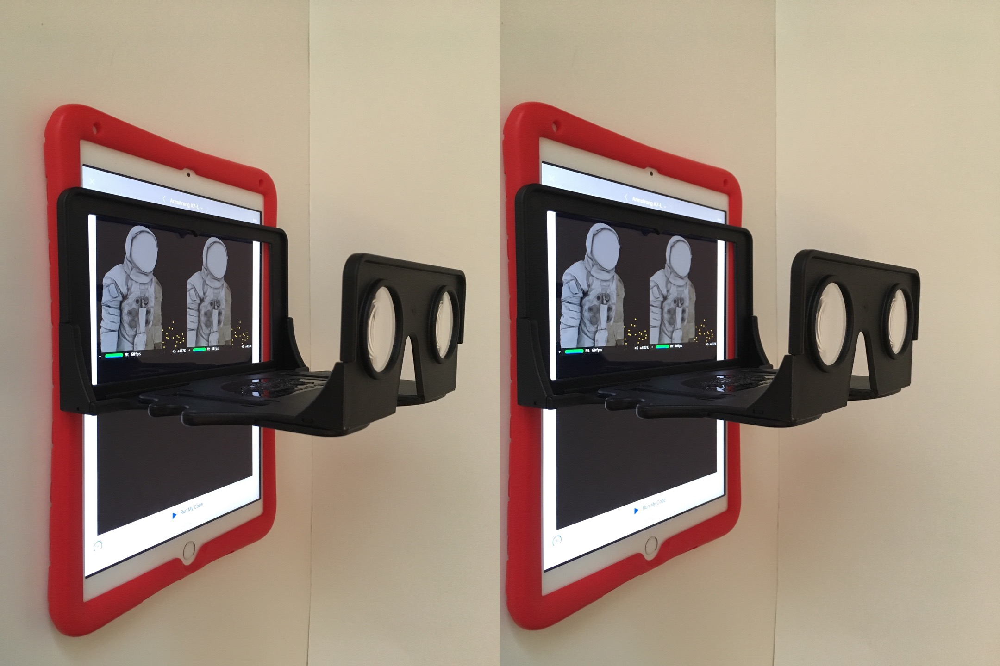
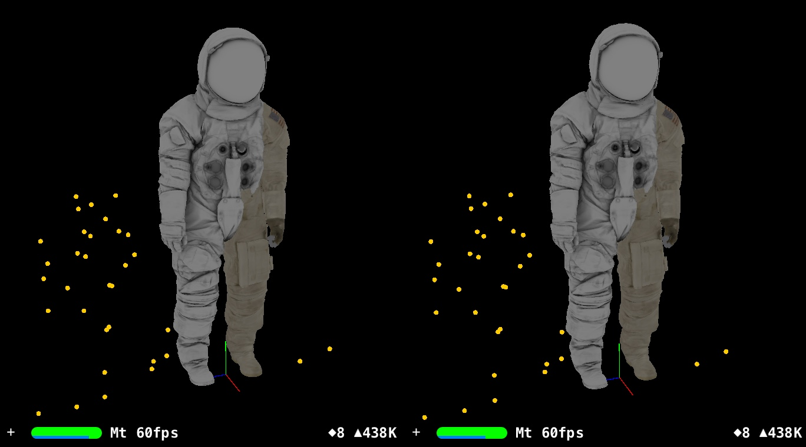
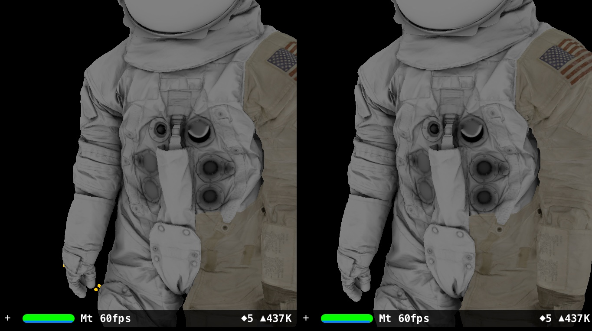
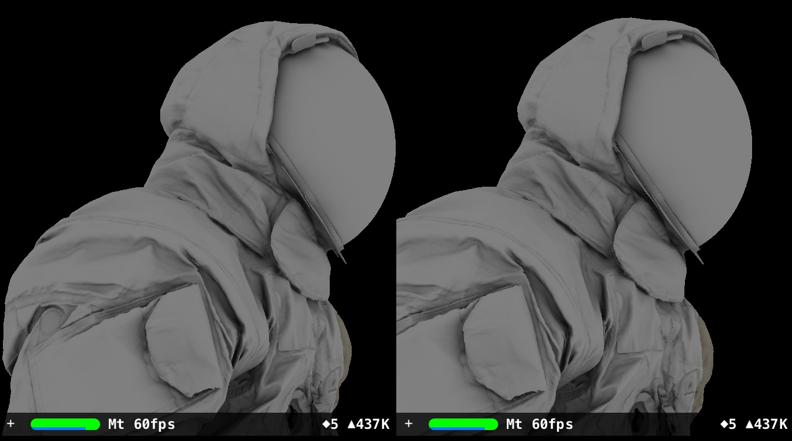

# ARKit-Stereoscope-Armstrong-A7L (under construction)
Explore Neil Armstrong's A7-L spacesuit from the Smithsonian Institution with a 6DOF tracking stereoscope.

# Hardware

Tested on Apple 2018 9.7" iPad (A9 CPU or higher for ARKit).

The OWL Stereoscopic Viewer(£15.00) from [The London Stereoscopic Company Ltd](https://www.londonstereo.com/)

https://github.com/Physicslibrary/ARKit-Stereoscope-CDEM explains how to use the stereoscope with a 9.7" iPad.

# Software

Apple Swift Playgrounds 3.0 from iOS App Store. Swift Playgrounds lets kids ages >4 program their iPad directly to experiment with ARKit and Scenekit.

https://www.apple.com/ca/swift/playgrounds/

ARKit and SceneKit (set up scene, read 3D files, attact a virtual camera for lefteye to ARKit iPad camera righteye to make a stereoscope, 6DOF tracking)

# Installation

With Swift Playgrounds 3.0 update, the file structure has changed from 2.2.

To keep things simple, a source file learn.swift is available for pasting into Playgrounds. Resources for the program will either be made available or links provided. It is assumed that users know how to download files into iOS Files App, unzip, and transfer into Playgrounds (eg. bottom of https://github.com/Physicslibrary/ARKit-Stereoscope).

Download armstrong_suit-ar_model.zip from the Smithsonian Institution https://3d.si.edu/armstrong

This is the "AR Ready Model Suit - .OBJ and .JPG (23.6 MB)" in the "Other Models" section of the webpage.

This playground uses the following files: 
ar_low_piece1.obj 
ar_low_piece2.obj 
ar_low_piece3.obj 
piece1_ao.jpg 
piece1_basecolor.jpg 
piece2_ao.jpg 
piece2_basecolor.jpg 
piece3_ao.jpg 
piece3_basecolor.jpg 

Add the files in Swift Playgrounds by tap "+", tap paper icon, and "Insert From...".

Tips:
 
If frame rate <60Hz, hold iPad still, swipe up from bottom edge of screen for HOME screen (or press HOME button), return to Swift Playgrounds.

This playground doesn't look for a flat plane to put virtual objects on, instead the initial position of the iPad is the world origin when "Run My Code" is pressed. Hold iPad near floor before "Run My Code" with "Enable Results" off.

All virtual objects are positioned and oriented according to this world origin (with righteye.debugOptions on, the world origin is an XYZ or RGB axis) 

Example screenshots of the A7-L spacesuit 3D mesh with one AO ambient occlusion or one basecolor texture. 

# References

armstrong_suit-ar_model.zip 
The Smithsonian Institution 
https://3d.si.edu/armstrong 

https://airandspace.si.edu/collection-objects/pressure-suit-a7-l-armstrong-apollo-11-flown 

https://en.wikipedia.org/wiki/Apollo/Skylab_A7L 

https://nasa3d.arc.nasa.gov/models 

https://en.wikipedia.org/wiki/Ambient_occlusion  

Copyright (c) 2019 Hartwell Fong
